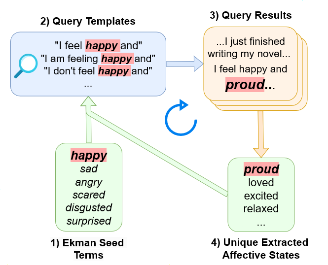

# MASIVE
Code accompanying the paper ["MASIVE: Open-Ended Affective State Identification in English and Spanish"](https://arxiv.org/pdf/2407.12196), Deas et al., 2024 presented at the 2024 Conference on Empirical Methods in Natural Language Processing.




# Setup

1. Clone the repository
2. Create a virtual environment and install all dependencies
   ```
    pip install -r requirements.txt
   ```
3. Run `setup.sh` to download the data and make all experiment scripts executable. The data download includes the English and Spanish subsets of masive, train/validation/test splits, regional Spanish data, translated data, and subsetted data used throughout experimental results.

# Experiments

Scripts are included in the `code` directory to train and evaluate models used in each experiment. The `code/configs` directory contains the configs used for each experiment and can be modified to alter training.
mT5 and T5 experiments were run using 2 A100 GPU's.

## MASIVE Benchmark

To reproduce the benchmark experiments, follow the steps below:
1. Navigate to the base directory, `MASIVE`
2. Run the following two scripts to train the English and Spanish models.
   ```
   CUDA_VISIBLE_DEVICES=<GPU_IDS> code/train_internal_en.sh
   CUDA_VISIBLE_DEVICES=<GPU_IDS> code/train_internal_es.sh
   ```
3. Run the following script to evaluate the finetuned English and Spanish models.
   ```
   CUDA_VISIBLE_DEVICES=<GPU_IDS> code/masive_eval.sh
   ```

## External Evaluation
To reproduce the external evaluation experiments, follow the steps below:
1. Run steps 1 and 2 above to finetune the necessary mT5 models
2. Run the following scripts to finetune the mT5 models on the necessary emotion datasets.
   ```
   CUDA_VISIBLE_DEVICES=<GPU_IDS> code/train_external_en.sh
   CUDA_VISIBLE_DEVICES=<GPU_IDS> code/train_external_es.sh
   ```
3. Run the following script to evaluate the finetuned mT5 models.
   ```
   CUDA_VISIBLE_DEVICES=<GPU_IDS> code/eval_external.sh
   ```

# Citation
If you use MASIVE or the resulting models in your work, please cite our paper.
```
@misc{deas2024masiveopenendedaffectivestate,
      title={MASIVE: Open-Ended Affective State Identification in English and Spanish}, 
      author={Nicholas Deas and Elsbeth Turcan and Iván Pérez Mejía and Kathleen McKeown},
      year={2024},
      eprint={2407.12196},
      archivePrefix={arXiv},
      primaryClass={cs.CL},
      url={https://arxiv.org/abs/2407.12196}, 
}
```

# Contact
For any questions, please contact [ndeas@cs.columbia.edu](mailto:ndeas@cs.columbia.edu)
